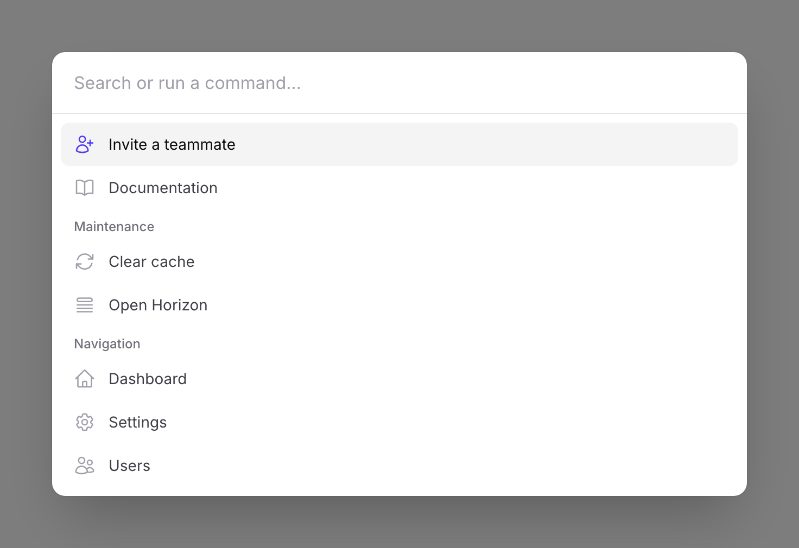
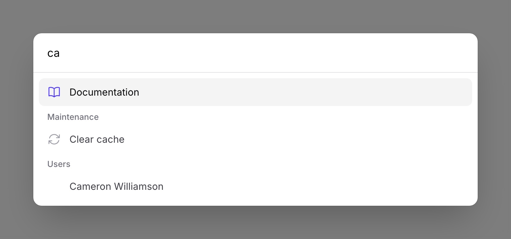
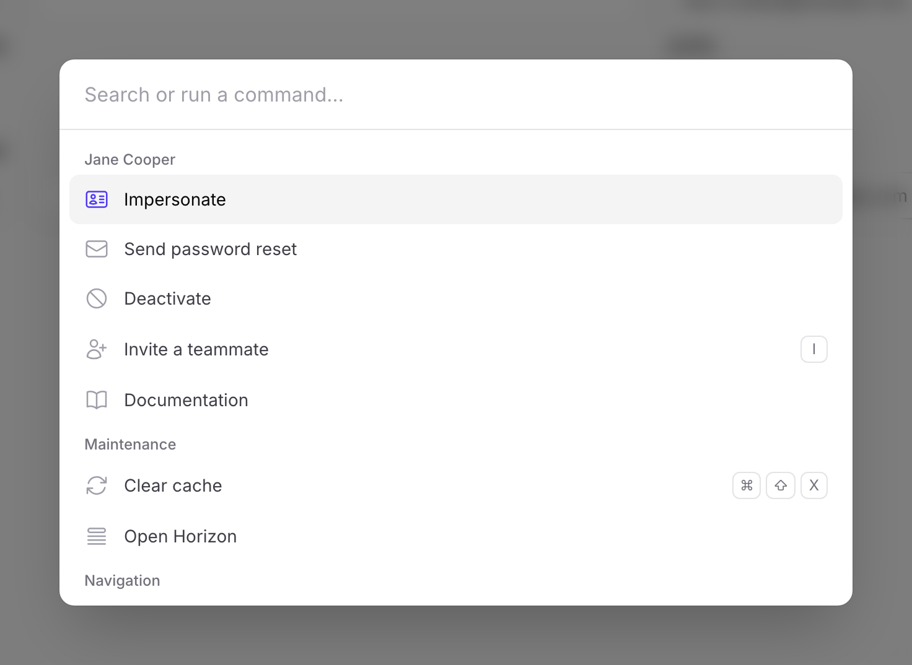

# Filament Spotlight

A ⌘K command menu for [Filament 5](https://filamentphp.com) panels — search and quick actions, built on [cmdk](https://github.com/pacocoursey/cmdk) with a fluent, hookable PHP API.

<picture>
  <source media="(prefers-color-scheme: dark)" srcset="art/spotlight-dark.png">
  
</picture>

- **Command menu** opened with <kbd>⌘K</kbd> / <kbd>Ctrl+K</kbd>, with fuzzy matching, keyboard navigation, and grouped results.
- **Navigation index**: every page and resource in your panel is instantly searchable, respecting visibility and authorization.
- **Global search**: records from your resources' [global search](https://filamentphp.com/docs/panels/resources/global-search) appear while you type.
- **Custom commands**: register actions with a fluent API — navigate to URLs, dispatch Livewire events, or run server-side closures.
- **Context-aware**: commands for the page — or record — the user is viewing are pinned to the top, Linear-style.
- **Keybindings**: Linear-style per-command shortcuts, shown on the item and working panel-wide — even before the menu is opened.
- **Hookable**: pages, resources, plugins, and packages can all contribute commands.

<picture>
  <source media="(prefers-color-scheme: dark)" srcset="art/spotlight-search-dark.png">
  
</picture>

The UI ships as a self-contained React island (react + cmdk bundled, ~28 KB gzipped, loaded once and cached). Your app needs **no Node build step** and no theme changes. All command definitions, search, and authorization stay server-side — the browser only ever sees display payloads and command IDs.

## Requirements

- PHP 8.3+
- Laravel 11 or 12
- Filament ^5.0

## Installation

```bash
composer require superscript/filament-spotlight
php artisan filament:assets
```

Register the plugin in your panel provider:

```php
use Superscript\FilamentSpotlight\SpotlightPlugin;

public function panel(Panel $panel): Panel
{
    return $panel
        // ...
        ->plugin(SpotlightPlugin::make());
}
```

That's it — press <kbd>⌘K</kbd> in your panel. Navigation and global search work out of the box.

## Registering commands

```php
use Superscript\FilamentSpotlight\Commands\Command;
use Superscript\FilamentSpotlight\Commands\CommandGroup;
use Superscript\FilamentSpotlight\SpotlightPlugin;

SpotlightPlugin::make()
    ->groups([
        CommandGroup::make('maintenance')->label('Maintenance')->sort(50),
    ])
    ->commands([
        // Navigate to a URL
        Command::make('open-horizon')
            ->label('Open Horizon')
            ->icon(Heroicon::OutlinedQueueList)
            ->url(fn (): string => route('horizon.index'), shouldOpenInNewTab: true),

        // Run a closure on the server
        Command::make('clear-cache')
            ->label('Clear cache')
            ->keywords(['flush', 'artisan'])
            ->group('maintenance')
            ->visible(fn (User $user): bool => $user->isAdmin())
            ->action(function () {
                Artisan::call('cache:clear');

                Notification::make()->title('Cache cleared')->success()->send();
            }),

        // Dispatch a Livewire event in the browser (no server roundtrip)
        Command::make('toggle-sidebar')
            ->label('Toggle sidebar')
            ->dispatch('sidebar-toggle'),
    ]);
```

A command defines exactly one behaviour: `action()` (server-side closure), `url()`, or `dispatch()`. An `action()` closure that returns a string redirects the browser to it.

### Closures everywhere

Almost every method accepts a closure, evaluated lazily on the server with Filament-style named and typed parameter injection — `$command`, `$panel`, `$user`, and `$context` are available:

```php
->commands(fn (User $user, Panel $panel): array => [
    Command::make('my-account')
        ->label("Signed in as {$user->name}")
        ->url(fn (): string => ProfilePage::getUrl()),
])
```

`commands()` can be called multiple times; other plugins and packages can contribute too:

```php
SpotlightPlugin::get()->commands([...]);
```

### Keybindings

Give a command a Linear-style keyboard shortcut:

```php
Command::make('assign')
    ->label('Assign to…')
    ->keybinding('a')             // single key, or a chord like 'mod+shift+m'
    ->action(...),
```

The shortcut renders as chips on the item (<kbd>⌘</kbd> <kbd>⇧</kbd> <kbd>M</kbd> on macOS, <kbd>Ctrl</kbd> <kbd>Shift</kbd> <kbd>M</kbd> elsewhere) and runs the command directly:

- **While the menu is closed**, shortcuts work anywhere in the panel. Shortcuts without a modifier (like `a`) are suppressed while a text field is focused, so they never steal keystrokes.
- **While the menu is open**, shortcuts with a modifier still fire; plain keys type into the search input instead.

Keybound commands ship with the page, so shortcuts work before the menu has ever been opened — visibility and authorization are still enforced server-side when the command executes. Dynamic (provider) commands can display a keybinding too, but it only fires while they are listed in the open menu.

### Visibility & authorization

```php
Command::make('danger-zone')
    ->visible(fn (User $user): bool => $user->isAdmin())  // or ->hidden(...)
    ->authorize('manage-settings')                        // Gate ability
    ->action(...);
```

Both checks run when the index is built **and again when a command is executed** — hiding a command client-side is presentation only; the server is the enforcement point (403).

## Commands from pages & resources

Any panel page or resource can contribute commands by implementing `HasSpotlightCommands`:

```php
use Superscript\FilamentSpotlight\Commands\Command;
use Superscript\FilamentSpotlight\Contracts\HasSpotlightCommands;

class Settings extends Page implements HasSpotlightCommands
{
    public static function getSpotlightCommands(): array
    {
        return [
            Command::make('settings:reset')
                ->label('Reset settings')
                ->action(fn () => static::reset()),
        ];
    }
}
```

## Contextual commands

Linear-style context awareness: commands scoped to the page the user is currently on are pinned to the top of the menu. Implement `HasContextualSpotlightCommands` on a page or resource — it is only consulted while the user is there, and receives a `PageContext` with the current `page`, `resource`, and (on record pages) the resolved `record`:

```php
use Superscript\FilamentSpotlight\Commands\Command;
use Superscript\FilamentSpotlight\Contracts\HasContextualSpotlightCommands;
use Superscript\FilamentSpotlight\PageContext;

class UserResource extends Resource implements HasContextualSpotlightCommands
{
    public static function getContextualSpotlightCommands(PageContext $context): array
    {
        // On /admin/users/3/edit — commands for that user:
        if ($user = $context->record) {
            return [
                Command::make("users:{$user->getKey()}:deactivate")
                    ->label('Deactivate')
                    ->icon(Heroicon::OutlinedNoSymbol)
                    ->authorize('update', $user)
                    ->action(fn () => $user->deactivate()),
            ];
        }

        // On /admin/users — commands for the list page:
        return [
            Command::make('users:export')
                ->label('Export users')
                ->action(fn () => /* ... */),
        ];
    }
}
```

<picture>
  <source media="(prefers-color-scheme: dark)" srcset="art/spotlight-context-dark.png">
  
</picture>

Contextual commands are grouped under the record's title when there is one, otherwise the resource's or page's label; set an explicit `->group()` to override. Any other command can be pinned into the contextual section with `->contextual()`.

The client reports its current URL when the menu opens; the server resolves it through the router. The page must belong to the panel, and records resolve through the resource's scoped Eloquent query, so tenancy and query scoping apply. Like provider commands, contextual command names must be **deterministic** (include the record key): the command is re-materialized from the same URL on execute, and visibility/authorization are re-checked before anything runs — make those checks record-aware where it matters, as in `->authorize('update', $user)` above.

Plugin-registered `commands()` closures can also become context-aware through the injected `$record` and `$pageContext`:

```php
->commands(fn (?Model $record): array => $record ? [
    Command::make("copy-id-{$record->getKey()}")
        ->label('Copy record ID')
        ->dispatch('copy-to-clipboard', ['text' => $record->getKey()]),
] : [])
```

## Dynamic commands (search providers)

For results that depend on what the user types (recent documents, external APIs, …), implement `CommandProvider`. Providers are queried server-side on every debounced keystroke:

```php
use Superscript\FilamentSpotlight\Contracts\CommandProvider;
use Superscript\FilamentSpotlight\SearchContext;

class DocumentProvider implements CommandProvider
{
    public function search(SearchContext $context): array
    {
        return Document::search($context->query)
            ->take(5)
            ->get()
            ->map(fn (Document $document) => Command::make("documents:{$document->id}")
                ->label($document->title)
                ->group('documents')
                ->url($document->url))
            ->all();
    }
}

SpotlightPlugin::make()->providers([DocumentProvider::class]);
```

> [!IMPORTANT]
> Provider command names must be **deterministic** (e.g. `documents:{id}`): when a provider command is executed, the provider is re-run with the same query to re-materialize the command by its name, and visibility/authorization are re-checked before anything runs.

Besides `query`, `panel`, and `user`, the `SearchContext` exposes `pageContext` — the resolved current `page`, `resource`, and `record` — so providers can tailor results to where the user is.

## Configuration

```php
SpotlightPlugin::make()
    ->keybindings(['mod+k', 'mod+/']) // 'mod' = ⌘ on macOS, Ctrl elsewhere
    ->placeholder('What do you need?')
    ->navigation(false)               // drop pages/resources from the index
    ->globalSearch(false);            // drop record results
```

## Opening the menu programmatically

From PHP (any Livewire component):

```php
$this->dispatch('filament-spotlight:open'); // also :close, :toggle
```

From JavaScript:

```js
window.FilamentSpotlight.open() // .close(), .toggle()
```

## Theming

The menu is styled with Filament's CSS custom properties (`--gray-*`, `--primary-*`), so it follows your panel's palette and dark mode automatically — nothing to configure. To restyle it, target the `[cmdk-*]` attributes under `.fi-spotlight` in your own CSS.

## Development

```bash
composer install && npm install
npm run build          # bundle resources/js + css into dist/
composer test          # Pest
composer analyse       # PHPStan
composer format        # Pint
```

`dist/` is committed so installing apps never need Node.

### Demo app & screenshots

`workbench/` contains a demo panel (see `testbench.yaml`) used to generate the README screenshots. Run it with:

```bash
vendor/bin/testbench workbench:build   # migrate + seed + publish assets
vendor/bin/testbench serve             # demo panel on http://127.0.0.1:8000/admin
```

It logs in automatically via `/_workbench` (demo@example.com / password). To regenerate the screenshots in `art/`:

```bash
npx playwright install chromium        # once
npm run screenshots
```

## License

MIT
